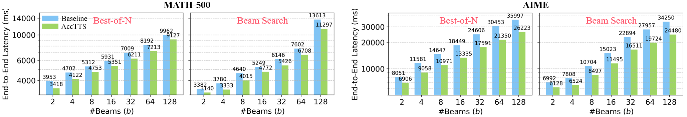
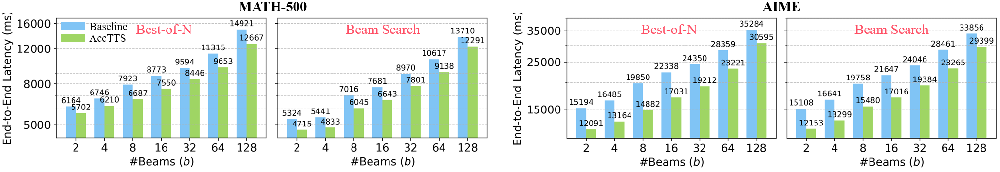
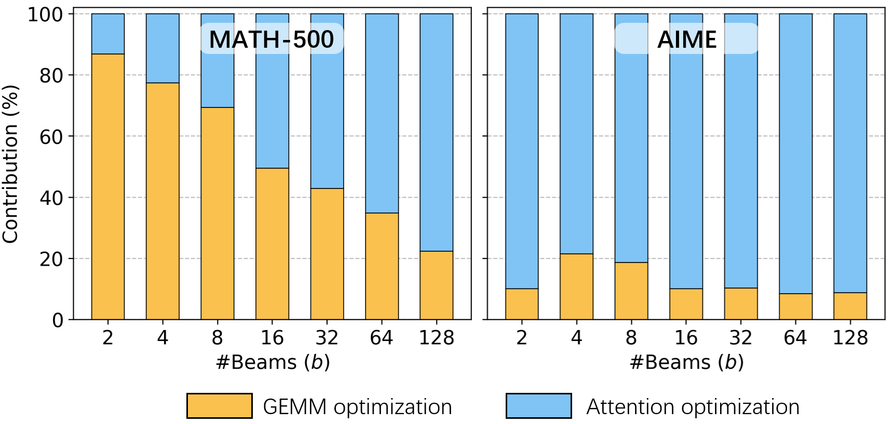

# AccTTS: Characterizing and Optimizing Workload Dynamics in Test-Time Scaling

AccTTS is a computational optimization framework for test-time scaling (TTS). During each reasoning step, beams finish asynchronously, so the active beam count decreases while the contexts of surviving beams grow. This evolution causes small-$M$ GEMM inefficiency, reduces beam-level attention parallelism, and progressively shifts latency dominance toward attention.

Our contributions are:

- We characterize TTS workload dynamics and connect decreasing active beam counts and growing contexts to inefficient skinny GEMMs, declining attention parallelism, and increasing attention dominance.
- We design AccTTS with two complementary adaptations: beam-adaptive GEMM execution follows the changing beam count, while adaptive context parallelization exploits growing contexts to recover attention parallelism.
- We integrate AccTTS into vLLM and achieve up to a **1.43x end-to-end speedup** across GPUs, TTS algorithms, models, datasets, and compute budgets.

## Quick Setup

### Environment

Create the exported Conda environment and install AccTTS:

```bash
conda env create -f environment.yml
conda activate sal_new_vllm
pip install --no-deps -e .

export VLLM_USE_V1=1
export VLLM_ATTENTION_BACKEND=TRITON_ATTN_VLLM_V1
export VLLM_ENABLE_V1_MULTIPROCESSING=0
```

The exported environment reproduces the accepted-paper setup with Python 3.11, CUDA 12.4, PyTorch 2.6.0, vLLM 0.8.5, and Triton 3.2.0. A compatible NVIDIA driver is required. Some models also require authentication through the Hugging Face CLI.

### Profile GEMM Kernels

```bash
python scripts/gemm_best_templates_collect.py recipes/best-of-n.yaml
```

### Profile Attention Chunk Settings

```bash
python scripts/chunk_setting_profile.py recipes/best-of-n.yaml
```

### Build the LUT

Execute `scripts/chunk_profile_results_analyze.ipynb` to aggregate the profiling results and build the runtime lookup table:

```bash
jupyter nbconvert --to notebook --execute scripts/chunk_profile_results_analyze.ipynb --inplace
```

Expected generated files:

```text
data/{model_path}/chunk_setting_profile_results.csv
data/{model_path}/profile_results_best_method.csv
data/{model_path}/profile_results_lut.json
data/{model_path}/profile_results_lut.npz
```

## Quick Start

### Trace the Task for Replay

Run the unoptimized beam-search configuration once to record per-step generation lengths and completion behavior:

```bash
python scripts/beam_search_task_trace.py recipes/beam-search.yaml
```

The trace is written under `data/{model_path}/{dataset_name}/`. Keep the same `model_path`, `dataset_name`, and `n` for replay.

### Replay with AccTTS

Set the following options in `recipes/beam-search.yaml`:

```yaml
gemm_opt: true
chunk_size: dynamic
```

Then replay the recorded task with AccTTS:

```bash
python scripts/beam_search_beam.py recipes/beam-search.yaml
```

## Results

### End-to-End Acceleration

<p align="center">
  
</p>
<p align="center">
  
</p>

### Contribution Analysis

<p align="center">
  
</p>

## Repository Structure

- `.github/`: repository workflows.
- `agent_markdown/`: templates for agent-assisted workflows.
- `figures/`: paper and evaluation figures.
- `recipes/`: model and TTS configuration files.
- `scripts/`: profiling, tracing, replay, evaluation, and plotting scripts.
- `src/`: TTS pipeline and AccTTS runtime implementation.

Large generated outputs, local model caches, raw experiment data, and binary Nsight reports are not maintained in this repository.

## Profiling and Evaluation

The main profiling and evaluation entry points are located under `scripts/`:

- `gemm_best_templates_collect.py` profiles GEMM kernel designs.
- `chunk_setting_profile.py` profiles context-splitting configurations.
- `chunk_setting_LUT_builder.py` prepares runtime attention configurations.
- `test_time_compute.py` runs end-to-end TTS evaluation.
- `attribution_analysis.ipynb` generates the optimization contribution analysis.

## Recipe Instructions

`recipes/best-of-n.yaml` defines the workload, model, sampling budget, and AccTTS configuration. Its main parameters are:

- `dataset_name` and `dataset_split`: Hugging Face dataset and split to evaluate.
- `model_path`: generation model identifier or local model path.
- `prm_path`: process reward model identifier or local path.
- `gpu_memory_utilization`: fraction of GPU memory allocated to vLLM.
- `approach`: TTS algorithm; use `best_of_n` for this recipe.
- `n`: number of independently generated candidate trajectories.
- `search_batch_size`: number of dataset examples processed in each search batch.
- `num_samples`: optional limit on the number of dataset examples; omit it to run the full split.
- `max_tokens`: maximum number of generated tokens per trajectory.
- `seed`: random seed used by the inference engine.
- `disable_prm`: skips PRM scoring when `true`, which is useful for timing-only experiments.
- `gemm_opt`: enables beam-adaptive GEMM execution when `true`.
- `chunk_size`: selects the attention mode: `dynamic` uses the profiled AccTTS LUT, `heuristic` uses the heuristic split-K path, and `none` uses the default attention path.
- `timing_enabled`: enables detailed kernel timing collection.
- `sort_completed` and `filter_duplicates`: control output ordering and duplicate removal.
- `push_to_hub`: uploads generated results to the Hugging Face Hub when enabled.
- `padded_prompt_len`: optionally left-pads prompts to a target token length for controlled experiments.

Additional options and defaults are defined in `src/sal/config.py`.

## Acknowledgment

This codebase builds on [Hugging Face Search and Learn](https://github.com/huggingface/search-and-learn) and extends it with workload tracing, GEMM profiling, adaptive context parallelization, and runtime integration for AccTTS.
